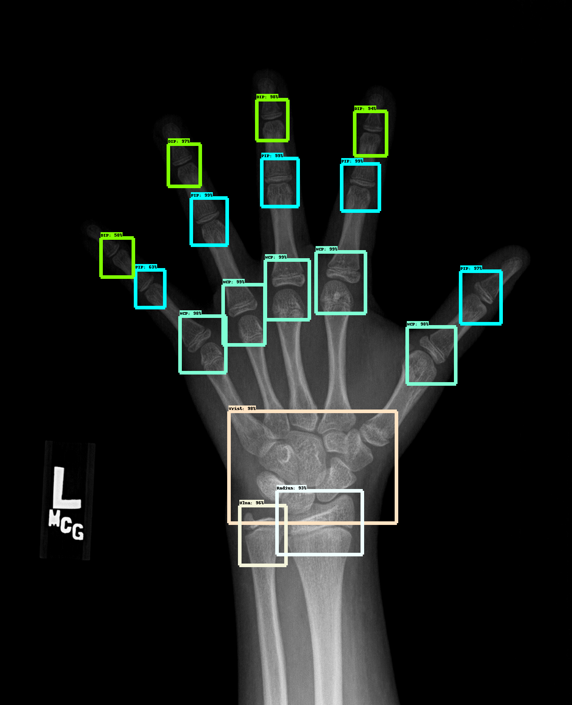

RSNA BoneAge - Ossification ROI Detection
=========================================

This repository contains additional annotations for the [RSNA Pediatric BoneAge Challenge](http://rsnachallenges.cloudapp.net/competitions/4) dataset. In total 240 training images and 89 evaluation images had been annotated with ROIs used in the medical routine for estimating boneage of hand radiographs. ROIs were labeled with one of the following: DIP, PIP, MCP, Radius, Ulna, and Wrist. In order to predict such ROIs on unseen images, the annotations were used to train a Faster-RCNN object detector using the [Tensorflow Object Detection API](https://github.com/tensorflow/models/tree/master/research/object_detection). An example inference visualization is shown below: 

For sake of reproducibility, the Tensorflow version as well as the Tensorflow Models repository is explicitly defined. The docker container uses a prebuild Tensorflow 1.4 image and the Tensorflow models repository is a commit from end of 2017. Please note, that GPUs newer than Pascal generation seem to not work with Tensorflow 1.4 (e.g. Titan V does not work). Either run the benchmark code on a Pascal card (e.g. GTX 1080 Ti) or try to update to a newer Tensorflow image.

# How to use

1. Download the dataset/images from the [RSNA Pediatric BoneAge Challenge](http://rsnachallenges.cloudapp.net/competitions/4) website
2. Export the path to the dataset as `RSNA_BONEAGE_DATASET_ROOT` environment variable (Note: the scripts assume a directory named `train/images` with all training images)
3. Install Docker and Nvidia Docker
4. Run `./build_and_run.sh` to build the docker container and start into it
5. Run `./prepare.sh` inside the container to download the pretrained model and build tfrecord files
6. Run `./benchmark.sh` inside the container to start the training of the benchmark models

# Citation

> S. Koitka, A. Demircioglu, M.S. Kim, C.M. Friedrich, F. Nensa:   
> **Ossification area localization in pediatric hand radiographs using deep neural networks for object detection**  
> PLOS One, Special issue: Machine Learning in Health and Biomedicine  
> Status: Accepted

The complete citation information will be provided once known.
